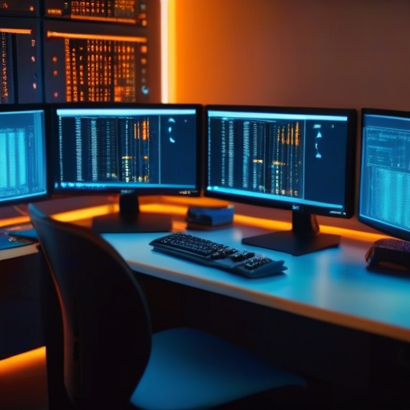
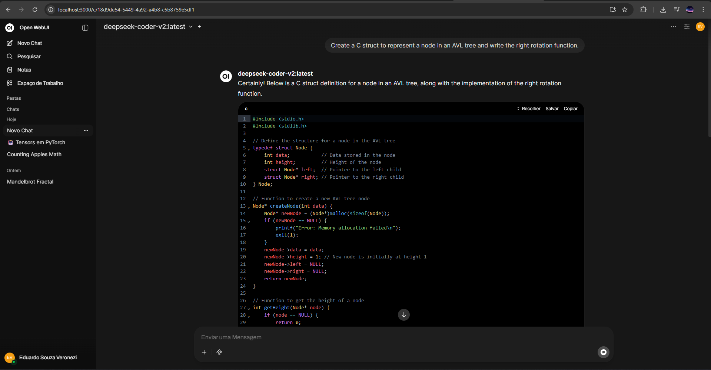
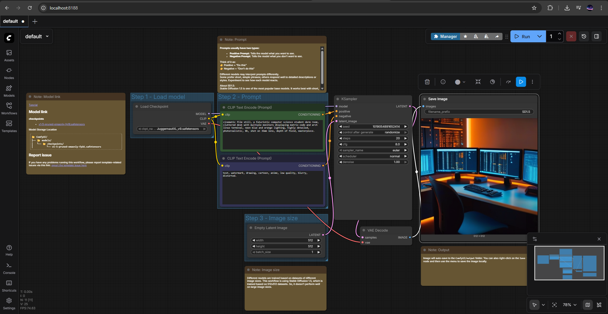

# 🧪 Local AI & High-Performance Computing Lab

> *Implementação de um ambiente local de Inteligência Artificial Generativa e Computação de Alto Desempenho utilizando hardware de consumo (RTX 5060).*


*Exemplo de geração: Prompt "Cyberpunk Arch Linux Setup" renderizado via Juggernaut XL em ~15s.*

---

## 📖 Sobre o Projeto
Este repositório documenta a criação de um laboratório de IA "Full-Stack" rodando localmente. O objetivo foi eliminar a dependência de APIs em nuvem (OpenAI/Google), garantindo privacidade total de dados e latência zero, além de explorar a arquitetura de sistemas Linux dentro do ecossistema Windows via virtualização leve.

---

## 🛠️ Infraestrutura e Arquitetura

### Sistema Operacional: Híbrido (Windows 11 + WSL 2)
A infraestrutura baseia-se no **WSL 2 (Windows Subsystem for Linux)**.

* **Decisão Técnica:**
    * Permite o uso de ferramentas nativas Linux (Ubuntu 22.04 LTS) essenciais para Data Science.
    * **GPU Passthrough:** O WSL 2 oferece acesso direto aos drivers da NVIDIA (CUDA) instalados no Windows, permitindo que o kernel Linux utilize todo o poder da RTX 5060 para cálculos tensoriais sem a sobrecarga de uma VM tradicional.
    * **Docker Integration:** Elimina problemas de compatibilidade de *filesystem* comuns no Docker Desktop for Windows.

**Specs do Hardware:**
* **CPU:** Intel Core i5 12400F (Single-core performance para emulação/compilação).
* **GPU:** NVIDIA RTX 5060 8GB (Tensor Cores para IA).
* **RAM:** 32GB (Essencial para carregar modelos LLM na memória).

### ⚙️ Configuração do Ambiente
1.  **Linux Distro:** Ubuntu 22.04 LTS (Jammy Jellyfish).
2.  **Permissões:** Configuração de usuário não-root com privilégios `sudo` e inclusão no grupo `docker`.
3.  **Drivers:** Utilização do *NVIDIA Container Toolkit* para permitir que containers Docker acessem a GPU através da camada de abstração do DirectX 12/WDDM 2.9.

---

## 🧠 O "Cérebro": LLMs e Inferência de Texto

Para a execução de modelos de linguagem, utilizei uma arquitetura containerizada.

### Backend: Ollama
Servidor de inferência local otimizado para chips Apple Silicon e NVIDIA.
* **Performance:** A execução ocorre via chamadas CUDA diretas.
* **Modelos Selecionados (Model Zoo):**
    * **Llama 3.1 8B (Quantizado):** Equilíbrio entre raciocínio lógico e velocidade.
    * **DeepSeek Coder V2:** Modelo especializado (Fine-tuned) em programação, superando modelos generalistas em tarefas de C e Java.

### Frontend: Open WebUI
Interface visual moderna rodando em Docker, conectada ao Ollama via rede interna.
* **Stack:** Docker Container na porta 3000.
* **Features:** Histórico persistente, Syntax Highlighting para código e suporte a RAG (Retrieval-Augmented Generation).



---

## 🎨 A "Visão": Pipeline de Geração de Imagens

Implementação de um pipeline de *Stable Diffusion XL* baseado em nós (Nodes).

### Engine: ComfyUI
Diferente de interfaces simples, o **ComfyUI** permite a manipulação granular do fluxo de tensores latentes.
* **Workflow:** Carregamento de Checkpoint -> Prompt Positivo/Negativo -> KSampler -> VAE Decode.
* **Gerenciamento de VRAM:** Otimização agressiva para rodar modelos SDXL (6GB+) em uma placa de 8GB, utilizando *offloading* inteligente para a RAM do sistema.



### Ferramentas de MLOps:
* **ComfyUI Manager:** Orquestrador para instalação automática de dependências e Custom Nodes.
* **Fallback Strategy:** Uso de scripts `curl` com redundância (Hugging Face) para baixar modelos quando repositórios primários (Civitai) apresentam instabilidade.

---

## 🔧 Desafios e Troubleshooting (Log de Engenharia)

Durante a implementação, documentei e solucionei os seguintes problemas técnicos:

### 1. Networking em Containers
* **Problema:** O container do WebUI não encontrava o Ollama.
* **Diagnóstico:** O Ollama escuta em `127.0.0.1` (localhost) por padrão, rejeitando conexões externas do Docker.
* **Solução:** Configurei a variável `OLLAMA_HOST=0.0.0.0` via systemd e utilizei o DNS interno `host.docker.internal` para ponte de rede.

### 2. Depreciação de Bibliotecas Linux
* **Problema:** Erro ao iniciar o ComfyUI: `ImportError: libGL.so.1`.
* **Causa:** O pacote `libgl1-mesa-glx` foi descontinuado no Ubuntu 22.04+.
* **Solução:** Migração para o pacote moderno `libgl1` (Vendor-Neutral GL dispatch library).

### 3. "Cold Start" da Aplicação
* **Sintoma:** Erro `ERR_EMPTY_RESPONSE` no navegador nos primeiros segundos.
* **Lição:** Necessidade de aguardar o *boot* completo do servidor Uvicorn interno antes de tentar conexão HTTP.

---

## ⚡ Guia de Execução (Runbook)

Como iniciar o laboratório após reiniciar a máquina:

1.  **Acordar a Infraestrutura:**
    ```bash
    sudo service docker start   # Inicia o Docker
    sudo systemctl start ollama # Inicia o Backend de IA
    ```
2.  **Subir o Laboratório de Imagem:**
    ```bash
    cd ~/ComfyUI
    source venv/bin/activate    # Ativar ambiente Python isolado
    python main.py              # Iniciar servidor na porta 8188
    ```
3.  **Acessos:**
    * **Chat & Code:** `http://localhost:3000`
    * **Image Studio:** `http://localhost:8188`

---

## ✅ Conclusão

Este projeto validou a viabilidade de desenvolvimento de IA de alta performance em ambiente Windows doméstico. A combinação de **WSL 2 + Docker + CUDA** provou-se uma stack robusta, permitindo iterar projetos de faculdade e protótipos de software com privacidade e sem custos de nuvem.